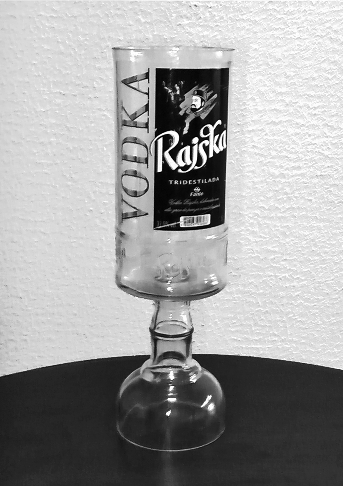

# Prefacio
Si sos cinéfilo, con seguridad ya te has preguntado cómo se hace una película. Cuando viste aquella escena que te “explotó la cabeza”, al salir del cine, ¿fuiste corriendo para tu casa y te metiste a algún motor de búsqueda para buscar el “cómo se filmó”? Entonces, ¿has pensado en tener esa misma curiosidad por el diseño de las cosas a tu alrededor?
Imaginá qué chévere ver un “cómo se hizo” de tu lindo teléfono celular, de tu querido automóvil, o de aquel sofá tan cómodo. Saber por qué fue hecho de aquella forma y con aquel material. Entender por qué te gusta tanto aquel objeto y conocer a las personas que los hicieron.
Imaginemos una utopía, en la cual tenemos los “cómo se filmaron” de todo lo que te imaginás, y no un “detrás de cámaras” puramente comercial de esos que parecen una propaganda. Algo más cercano a un documental que lleva al pie de la letra el *making of* (la realización), mostrando todos los detalles del proceso, sin guardarse secretos. Además de aprender más sobre el objeto, podrías aprender también sobre su diseño, valorando el trabajo de quien lo hizo.
Mirá por ejemplo el objeto mostrado la imagen a continuación. ¿Habías visto uno de esos? Si no, intentá adivinar: ¿para qué sirve? ¿Por qué fue hecho de esa forma? ¿Cuáles son sus componentes? Difícilmente podrás responder esas preguntas con sólo ver la imagen. Sin embargo, cuando te contemos, la imagen tendrá un significado completamente diferente.

Esta es una copa especialmente hecha para servir una bebida llamada *kapeta*, encontrada en el litoral del sur brasileño. El kapeta es una mezcla de otras bebidas, variando la composición de local a local. Esta copa fue hecha con el recipiente del ingrediente más común de la bebida: el vodka ruso. La copa fue hecha con la botella de vodka cortada por la mitad y colocada de cabeza. Se elabora de esta manera para reutilizar el material de desecho, y al mismo tiempo, permitir la distribución y poder compartir la bebida. La copa de mayor tamaño rinde para una mesa entera.
Ahora que conocés un poco más sobre el objeto, podrás apreciarlo mucho mejor, reconocer la sustentabilidad de la práctica de reciclaje, su papel social en el entretenimiento y la creatividad del emprendedor popular. El “cómo se hizo” del producto te vuelve un consumidor consciente, ¡no sólo de los aspectos negativos del consumo, sino principalmente de los aspectos positivos! El problema es que hoy en día, ese conocimiento sobre el producto no está disponible para los consumidores.
Es bastante común entre los arquitectos, diseñadores y programadores la práctica de haber desarmado juguetes para saber cómo funcionaban cuando eran niños, abrir aparatos electrónicos para descubrir de dónde viene el sonido, pintar con plumillas sin miedo de equivocarse, erguir ciudades increíbles con plastilina y bloquecitos de colores.
Aunque no fueras arquitecto, diseñador o programador, es probable que hayás hecho eso en algún momento de tu vida. Sin embargo, como la mayoría de las personas, acabaste perdiendo esa libertad de intentarlo. La curiosidad acaba siendo anulada, dejando en su lugar bloqueos y miedos. Estos, cuando se difunden por la sociedad, toman formas oficiales como la guerra de patentes y los derechos de autor.
Años atrás era común saber cambiar un tomacorriente, arreglar una ducha, tejer una blusa o reparar el carro. Hoy desconocemos totalmente el proceso de fabricación, cómo leer un plano de planta arquitectónica y hasta la receta de aquel pastel. Es preciso recuperar ese contacto con las cosas.
El “cómo se hizo” puede ser un primer paso. En lugar de ser considerado como una adición de poco valor, una de las propuestas de este libro es tornar el “cómo se hizo” en una parte integral del producto, un “cómo se hizo” que se vaya creando mientras se hace el producto, con la esperanza de que una vez lanzado, el producto pueda ser continuado por quien lo desee. Las ideas sobre el producto se van acumulando y esparciendo, lo que promueve una innovación colectiva y no solamente puntual.
Es eso lo que esperamos con este libro: la proliferación de proyectos libres y abiertos, que promuevan la innovación social. Para comenzar, presentamos a continuación el “cómo se hizo” de este libro.
> Caminante, no hay camino. Se hace camino al andar. [Antonio Machado]