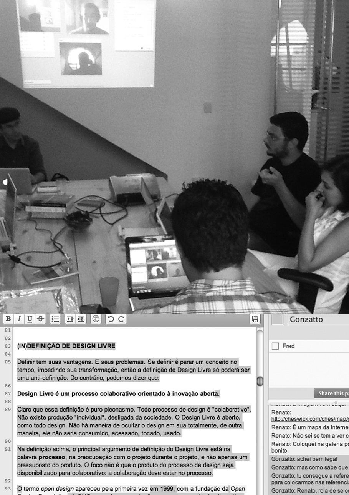

# Cómo fue escrito este libro

Este libro fue escrito en una semana, del 9 al 14 de febrero de 2012, utilizando una metodología de colaboración ágil llamada Booksprint (booksprints.net). Para ser coherente con las ideas del libro, todas las personas ligadas a la comunidad Faber-Ludens fueron invitadas a participar del libro. El llamado fue hecho por medio de listas de correo electrónico, Facebook, Twitter y otras redes sociales.

Se utilizaron tres espacios para colaboración: la oficina del Instituto Faber-Ludens en Curitiba, la plataforma corais.org y la herramienta de videoconferencias bigbluebutton.org, todos softwares libres. Varias personas pasaron por estos espacios y colaboraron en diferentes partes del libro, dando opiniones algunas veces divergentes, aunque convergentes en la mayoría de casos.

La oficina ofreció un ambiente acogedor para experimentaciones y discusiones rápidas; las actividades fueron transmitidas a través de BigBlueButton. Los participantes de la oficina colaboraron con textos online vía Corais, a través de la herramienta de edición en tiempo real etherpad.org; por tanto, quien no pudo asistir de forma presencial hasta la oficina pudo participar igualmente de la redacción y edición del libro.

Los textos fueron desarrollados en un principio en un borrador único. Poco a poco, el documento se fue desmembrando según los temas y contenidos en nuevos documentos colaborativos para ser ampliados de forma específica. Cuando un texto se consideró como “consolidado”, es decir, cuando ya había dejado de ser un borrador, se migró a un blog, que también fue alimentado con novedades y vídeos que resumían el trabajo realizado cada día.

También se escogieron textos con carácter literario y poemas inspirados en el movimiento de Poesía Concreta. El texto que más se trabajó fue el llamado “Qué es el Diseño Libre”, a partir del cual el texto base de este libro fue tomando forma.

Con el fin de optimizar la producción de nuevos textos, utilizamos una técnica llamada cariñosamente “El CX”, un homenaje al maestro inspirador Chico Xavier, el cual consistió en una pausa de concentración de 5 minutos, seguida de 15 a 20 minutos cronometrados de producción intensa y colaborativa en un espacio común. El CX es una apropiación de la comunidad Faber-Ludens del Método Pomodoro de gestión del tiempo. Así logramos recolectar rápidamente una gran cantidad de material para el libro.

El trabajo fue realizado en ciclos continuos de revisión y adecuamiento de los textos. El proceso se readecuaba cada día, en una adaptación continua del “cómo se hace”. Finalmente, el texto fue diagramado con el software libre Scribus, utilizando las siguientes fuentes libres hechas disponibles en el sitio openfontlibrary.org: News Cycle, Designosaur y Lerotica.

La plataforma de colaboración Corais guardó los rastros de toda esta colaboración, permitiendo que cualquier interesado en escribir un libro utilizando esta misma metodología pueda ver cómo fue realizado. Ahí es posible descargar todo el material del libro: el texto (en formato PDF y otros formatos para visualización en línea), su diagramación (en formato del software Scribus), todas las imágenes utilizadas (en formato PNG) y la documentación del proceso de trabajo (en imágenes, textos, discusiones y vídeos).

Corais es una plataforma integrada de colaboración en proyectos de diseño basada en el software libre [Open Atrium](https://www.drupal.org/project/openatrium) (que, a su vez, está basado en Drupal) creado por el instituto Faber-Ludens para servir como base y referencia para ambientes de desarrollo de proyectos de Diseño Libre.

El proyecto de este libro, incluidos los textos y las imágenes producidas, han sido licenciados con Creative Commons 3.0 (ver la ficha), lo cual significa que cualquier persona puede utilizar este material para otros fines y también modificarlo, tomando en cuenta que se distribuya el resultado utilizando la misma licencia y se mencionen los créditos respectivos.

> Y que mis venas no terminan en mí, sino en la sangre unánime de los que luchan por la vida, el amor, las cosas, el paisaje y el pan, la poesía de todos. [Roque Dalton]