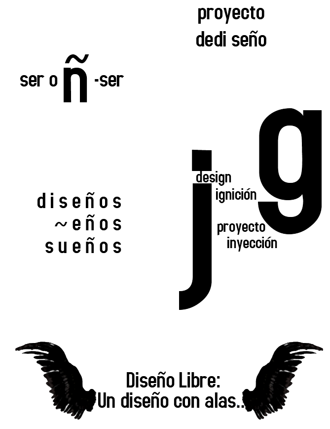

# El movimiento 

## Open design
El término “open design” apareció por la primera vez en 1999, entendido como el diseño cuyos creadores permiten su libre distribución y documentación, además de modificaciones y derivaciones -una definición semejante del modelo del software libre. Sus autores, de la ONG Open Design Foundation, vislumbraron un camino para promover un método alternativo para el diseño y el desarrollo tecnológico, a partir del libre intercambio de informaciones sobre diseño. 

El reciente lanzamiento del libro “Open Design Now” llamó la atención para la importancia del asunto en una audiencia más amplia de profesionales, estudiantes, críticos y entusiastas. El investigador italiano Massimo Menichinelli, fundador del proyecto OpenP2Pdiseño.org, escribió una serie de artículos titulados “Open Design is Going Mainstream Now” que muestran lo sintomático del surgimiento de plataformas de proyectos tales como OpenIDEO y el FrogMob, que permiten que las personas participen directamente en los proyectos de diseño de estas empresas, de concursos como (Un)limited Design Contest y de iniciativas de colaboración y distribución de conocimiento, como Droog y Design for Download. Junto a estos movimientos, tenemos nuevas herramientas como las impresoras 3D, placas Arduino (hardware libre) y las nuevas posibilidades generadas a partir del acceso a la información. 

Actualmente, más propuestas en torno de las iniciativas de Open Design aparecen por el mundo. En Brasil, se tiene el Design Livre, iniciativa experimentada en espacios como Instituto Faber-Ludens, Corais.org y LetsEvo. Este libro que estás leyendo significa una exposición de ideas que han venido siendo desarrolladas en los últimos años. 

## (In)definición de Diseño Libre 
Definir tiene sus ventajas, y sus problemas. Si definir comprende detener un concepto en el tiempo, impidiendo su transformación, entonces la definición de Diseño Libre solo podría ser una antidefinición. 

> Diseño Libre es un proceso colaborativo orientado a la innovación abierta. 

Esto es pleonasmo puro. Todo proceso de diseño es “colaborativo”. No existe producción “individual”, desconectada de la sociedad. El Diseño Libre es abierto, como todo diseño es en algún nivel. No hay forma de ocultar el diseño en su totalidad; de no ser así, éste no sería consumido, accedido, tocado, utilizado. Lo que puede ser “escondido” es justamente la forma de hacerlo. 

En la definición anterior, el principal argumento de definición del Diseño Libre está en la palabra “proceso”, en la preocupación con el proyecto durante el proyecto, y no apenas en un presupuesto del producto. El enfoque no es simplemente que el resultado sea abierto, sino que la colaboración esté integrada en el proceso. 

> Me rodea el gran Misterio, y ante él, humilde me inclino, que en silencio estoy formando todo un Destino. [Claudia Lars - El misterio]

