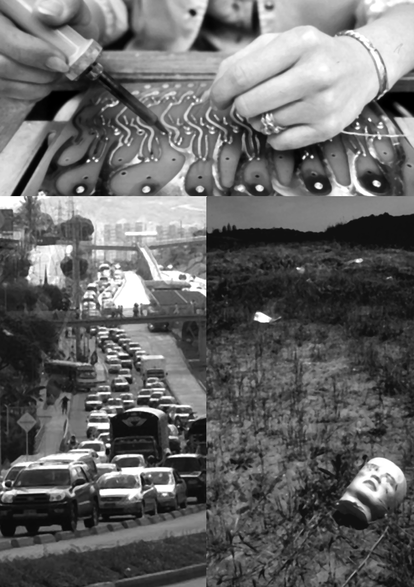

# Diseño en red
- Diseño son borradores, bosquejos, ilustraciones
- Diseño son prototipos, modelos, instrucciones
- Diseño es una solución: el producto, el servicio o beneficio generado por ellos para las personas
- Diseño son los aspectos estéticos de la solución
- Diseño es el proceso de búsqueda la solución a un problema
- Diseño es el conocimiento sobre procesos y productos
- Diseño es la facultad humana de interactuar con el ambiente y con los objetos que nos rodean, interfiriendo y transformando nuestro entorno
- Diseño es...

Dependiendo de la definición escogida para trabajar con diseño, serán enfocados ciertos aspectos y otros dejados de lado. El diseño se transforma en un instrumento para lograr objetivos, pero se pierde una noción inclusiva, variada y difusa por algo específico y estático, que puede ser comprendido mejor y, en última instancia, comprado y vendido.
En este libro queremos recuperar la multiplicidad del diseño perdida en la instrumentalización y especialización de áreas. Queremos traer de vuelta la esperanza de que el diseño es algo grandioso, capaz de transformar el mundo en un lugar mejor.
Pero, ¿Cuál sería ese mundo mejor? ¿Un mundo lleno de objetos que traen confort a unos pocos a costa de los recursos naturales no renovables? ¿Al precio del trabajo de quién? ¿Convertir en comunes y accesibles las cosas iguales, etéreas e impersonales? Ha llegado la hora de repensar lo que el diseño tiene para ofrecer al mundo.
¿Son las vías públicas repletas de carros?
¿Las fábricas de baratijas en países distantes?
¿Bodegas repletas de juguetes de plástico que tardarán milenios para descomponerse naturalmente?
Problemas capciosos como estos no pueden ser tratados simplemente como efectos laterales lamentables. Lo que parecería ocurrir por casualidad, fue proyectado. Existen proyectos dentro de proyectos. Existen proyectos de trabajo, proyectos de vida, proyectos de sociedad. Un proyecto está amarrado a otro —el límite de un proyecto es otro proyecto: la finalidad de todo eso.

¿Quién define esos proyectos? Aunque el proyecto aparentemente ocurra en las manos de los especialistas, estos no trabajan solos. El especialista tiene que lidiar con una serie de interesados en el proyecto, los llamados stakeholders (inversionistas) que, aunque no pongan una mano en la masa, participan activamente de la definición de los valores del proyecto. Los stakeholders, por su lado, no están defendiendo una posición estrictamente individual, sino una que representa las intenciones de los grupos que forman parte, de su clase social, de sistemas económicos, de su cultura.
Si consideramos que todas estas entidades afectan el proyecto, entonces podemos definirlo como un proyecto colectivo. Vos y yo. Conectados. Un proyecto donde los especialistas son solamente nodos de una red, nodos que concentran una cantidad de conexiones que permiten una accesibilidad a otros nodos mayores y una consecuente consciencia más amplia de posibilidades.
Este modelo de concentración funciona mientras las redes tienen recursos escasos y demandas administrables. Además de ser variada, dinámica y emergente, la demanda por diseño en el mundo es mayor de lo que algunos especialistas en el asunto pueden explicar.
Cuando la demanda aumenta, diversifica y los recursos se vuelven más accesibles, el modelo de concentración se vuelve demasiado lento para la red. Los nodos de especialistas acaban impidiendo que la red cree nuevas conexiones, y la red busca expandirse por caminos alternativos.
> El profesionalismo fusiona al individuo en patrones de acomodación ambiental total; el trabajo amateur busca el desenvolvimiento de la conciencia crítica sobre las reglas básicas de la sociedad. El amateur puede darse el lujo de perder; el profesional, por su parte, tiende a clasificar y especializar, a aceptar sin crítica las reglas básicas de la sociedad. Las reglas básicas, proporcionadas por la reacción en masa de sus colegas, sirven como un medio ambiente penetrante del cual el profesional extrae su satisfacción sin tener conciencia propia. El especialista es un hombre que se mantiene estático. [Marshall McLuhan]

Ahora nosotros estamos viviendo un momento de expansión de todos los tipos de redes. No son solo las redes de computadoras que se expanden, sino tambien las redes sociales las que permiten que las personas hagan algo en el mundo. El simple acto de cepillarse los dientes depende de la influencia de muchas redes:
- distribución de agua
- distribución de pastas y cepillos de dientes
- recolección y transformación de los materiales para el cepillo
- fabricación de los ingredientes para la pasta de dientes
- conocimientos relacionados a la salud bucal
- hábitos sociales
Si una conexión de esa red no existiese, el acto no ocurriría. Cuando nuevas conexiones son hechas, nuevos actos son posibles. La tendencia es aumentar, no disminuir, el grado de complejidad de la acción: el sujeto tendrá siempre más opciones a considerar, más objetos con los que interactuar, más conexiones a crear y mantener.
La disponibilidad de opciones es celebrada como la conquista de una libertad. Cuanta mayor es la cantidad de opciones disponibles, mayor es la libertad. Sin embargo, también aumenta la posibilidad de perplejidad, o sea, la incapacidad de tomar una decisión frente a tantas alternativas. La cantidad da la impresión de que todas las posibilidades ya fueron consideradas y que otras opciones no son posibles. Esta supuesta libertad de escoger es un engaño, pues el sujeto no construye sus opciones.
> “Se tiende a concebir la libertad y la individualidad como un estatus, como un estado. Se cree que un hombre es libre cuando vive en condiciones que le permiten la toma de decisiones libremente. Pero, solo es libre cuando se produce su libertad. En la más libre de las sociedades, aún hay esclavos entre los hombres, cuando los hombres entienden la libertad como una vestimenta y no como una concretización, como implementación, como proyecto.” [Otl Aicher]
La libertad que estamos discutiendo en el diseño libre es la libertad de proyecto. La libertad que cualquier ser humano tiene de conspirar por su libertad, de redefinir su realidad a traves del artificio. De reconocerse como agente, y no solo observador de la cultura material. Creemos que el diseño siempre fue libre. Esa posibilidad siempre existió. Sin embargo, ahora se torna tan crucial para los rumbos de la sociedad que deseamos enfatizar con ese nombre: diseño libre.
Por diseño libre entendemos la necesidad de repensar el diseño frente a las transformaciones de los sistemas de producción y consumo ocurridas recientemente por la diseminación de ideologías liberales y tecnologías de la información. ¿Cómo pensar una práctica de diseño que dé cuenta de esa multiplicidad de abordajes, técnicas, métodos, herramientas, conocimientos, valores, culturas que interpelan los proyectos contemporáneos?
Inspirado en las libertades fundamentales del Software Libre, proponemos las siguientes libertades para el diseño libre:
- La libertad de aprender a usar, independiente de un uso propuesto o esperado en un proyecto abierto que fuese consultado.
- La libertad de estudiar y reproducir el proceso que generó el producto, consultando las documentaciones de las decisiones de diseño: los archivos fuente.
- La libertad de colaborar con el proceso, incluso modificando el mismo.
- Alterar cualquier parte de un proceso.
- La libertad de aprender a hacer: de producir y reproducir.
> … ¿Y qué es libertad para vos?
