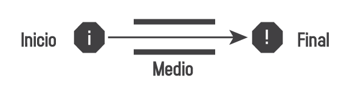
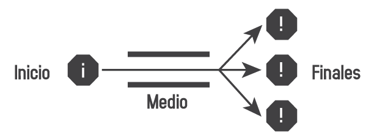
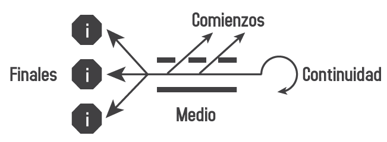

# El plan

Diseño es uno de estos términos que vienen extendiendo su significado progresivamente en las últimas décadas. Hoy en día, la estrategia de negocio es diseño, organización de informaciones es diseño, decorar ambientes es diseño, cortar el cabello es diseño... ¡todo se transformó en diseño!

En lugar de intentar contener y censurar el uso del término “diseño” para cualquier cosa que no sea un proyecto profesional, la propuesta de este libro es ayudar a comprender por qué las personas están apropiándose del término y potenciar lo que ellas pueden hacer con eso.

Si las personas dicen que el diseño es todo eso, ¿por qué defender que el diseño es menos que eso? ¿Por qué restringirnos a un tipo específico de diseño, si podemos percibir similitudes entre las diferentes interpretaciones del término? Tal vez el término “diseño” se está expandiendo porque el propio Diseño como área de conocimiento humano también se está expandiendo. La presencia del diseño en la sociedad está siendo cada vez más percibida y doblemente pensada por otras áreas capaces de lidiar con la complejidad de la vida moderna; la unidad en la diversidad de fundamentos que sirven de base para el diseño, lo vuelven plenamente inclusivo y, al mismo tiempo, coherente. En su esencia, el Diseño trata sobre la creación de planes.

Básicamente existen tres tipos de planes:

## Plan cerrado

Un plan cerrado tiene un principio, un medio y un fin definidos. El comienzo es una intención que se centra en un objetivo. Los medios son elegidos y desarrollados para alcanzar el objetivo. No se cuestiona el medio, ya que conlleva a un fin. En realidad, en un plan cerrado, el medio es irrelevante y el fin es igual al principio. El plan no cambia mientras se es ejecutado. El resultado no es compartido, no sirve para otros fines. Es como un proyecto sigiloso de desarrollo de nuevos productos que, al no dar resultados, termina engavetado.

## Plan abierto

El plan abierto comienza con una pregunta. Es posible no saber exactamente adónde quiere llegarse con el plan. El plan en sí es desarrollado en su ejecución. La pregunta no es direccionada a algo o alguien, es una pregunta abierta. Cualquier persona puede responderla, lo que implica que debe ser respondida, aunque las respuestas sean muchas. Lo importante para el plan abierto es que el resultado del plan sirva para varios fines. La ciencia trabaja con este tipo de plan.

## Plan libre

El plan libre comienza por el fin, o más bien, por los finales. Por los fines alcanzados por otros proyectos, por la reacción a las limitantes impuestas por ellos, por sus fallas y frustraciones. Es una especie de trabajo terapéutico donde las intenciones son pensadas constantemente. El medio es fundamental, pues no hay un fin para el plan libre. El plan es continuar siempre, sin objetivos definidos. En lugar de fines, el resultado de un plan libre son varios comienzos, varios planes que surgen a partir de este. Planes que, por su parte, pueden ser cerrados, abiertos o libres.

Estos tipos de planes son descripciones genéricas que de hecho no suceden aisladamente. Planes de diferentes tipos se cruzan; comienzan y no terminan; terminan y no comienzan. Las personas hacen planes en situaciones específicas y su actuar cambia de acuerdo con su situación. Por eso, el diseño es definido de diferentes maneras.

> El shangri-lá 
> Si lo buscas 
> Esta en ti, 
> no en las montañas  
> [Akumal - Shangri-lá]
