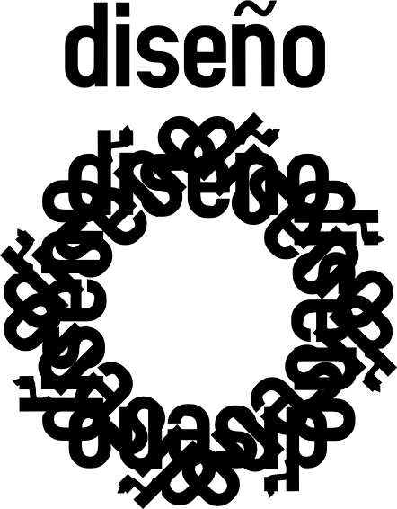
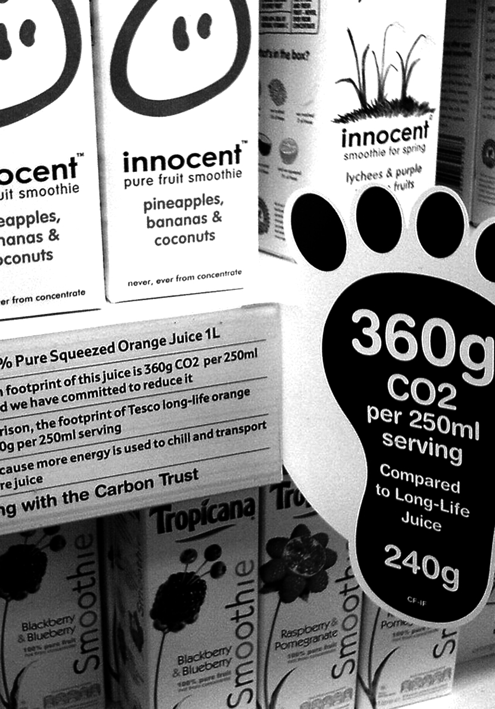
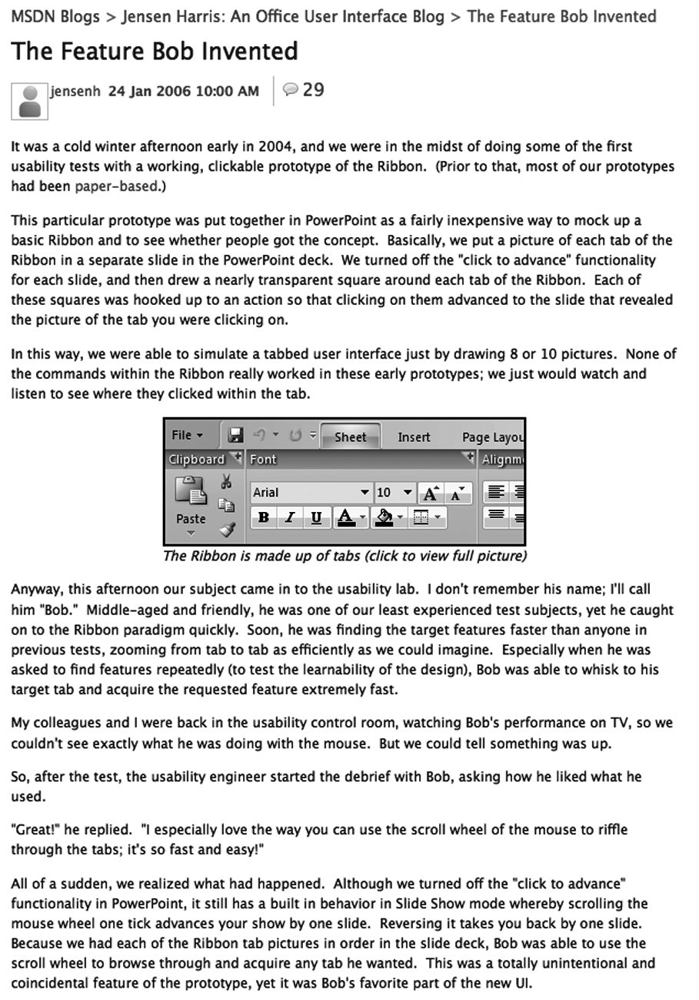
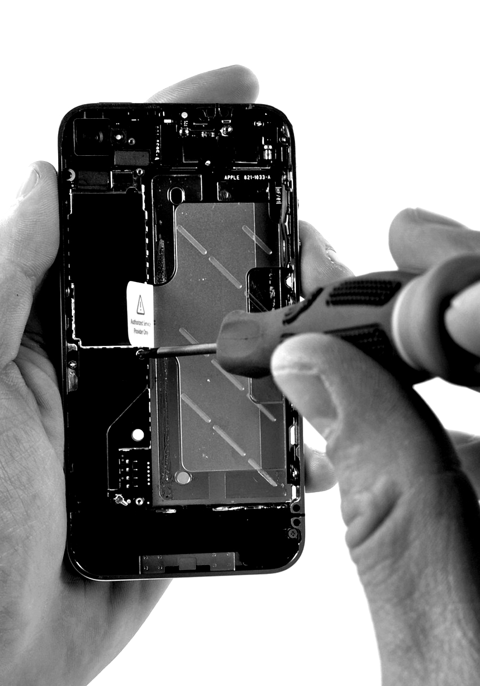
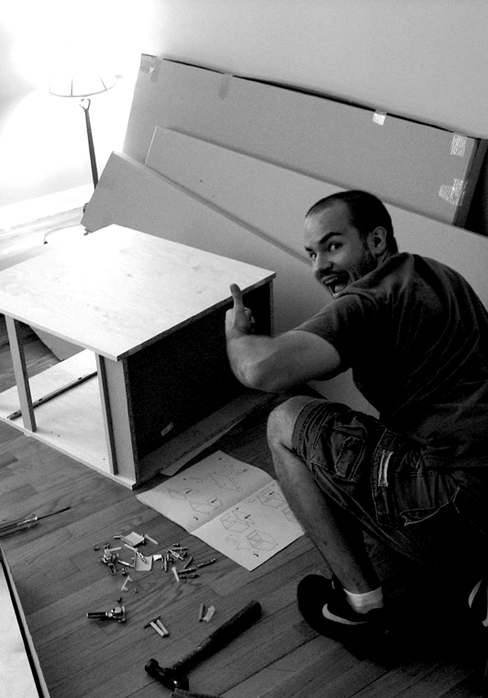
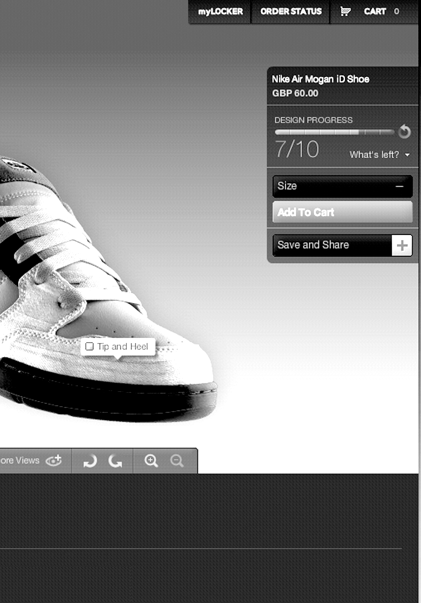
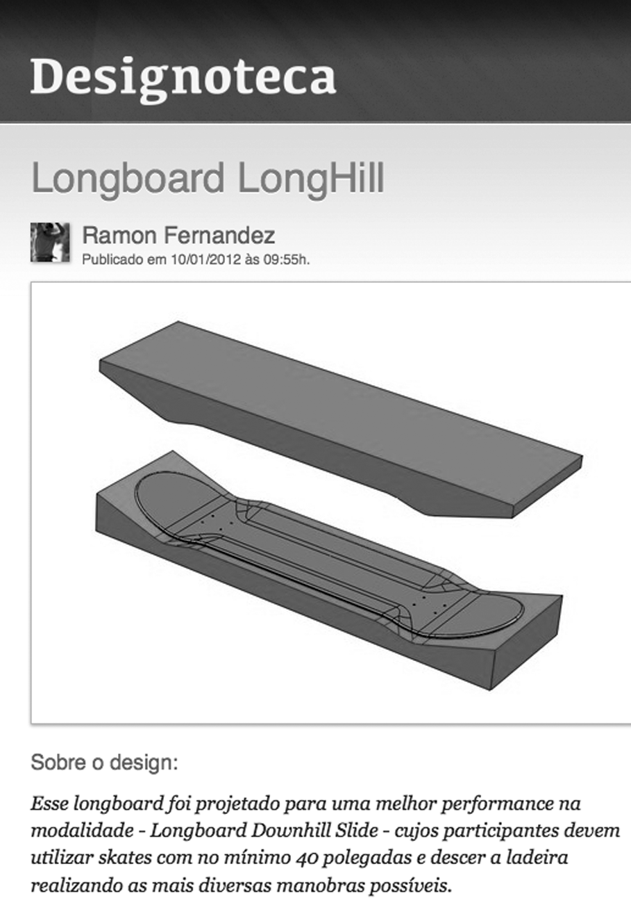
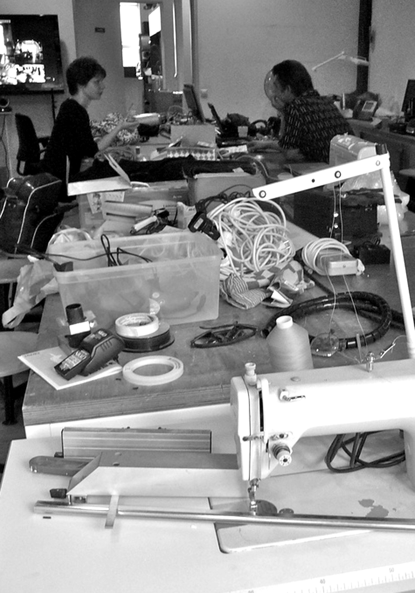
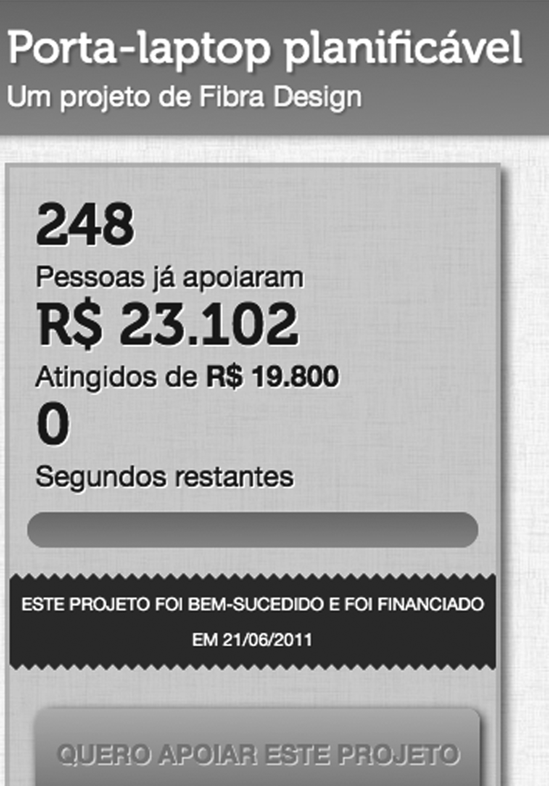

# Las propuestas 
Hasta aquí ofrecemos una discusión meramente conceptual, sin mostrar muchos ejemplos. Muchas propuestas fueron recopiladas, pero reconocemos que no todas son viables por el momento. En las próximas páginas, mostraremos las propuestas que el Diseño Libre defiende y que están siendo ya implantadas en varios lugares del mundo. Estas propuestas no agotan las posibilidades del Diseño Libre, pero están aquí para mostrar que es posible desarrollar proyectos prácticos y lucrativos con Diseño Libre. 

## Sensibilizar para el consumo consciente 
  * ¿Por qué? 
  Las consumidoras pueden tomar mejores decisiones cuando tienen información	sobre el origen del producto. 
  * ¿Cómo? Afiches y publicidad más descriptiva y manuales con información sobre el origen del material, huella de carbono, proceso de concepción y fabricación. 
  * Ejemplos La ONG Carbon Print mide el impacto ambiental de productos por la huella de carbono. 

## Entregar proyectos con su apropiada documentación. 
  * ¿Por qué? La documentación es útil para hacer modificaciones o mantenimiento mientras se usa. 
  * ¿Cómo? Utilizar herramientas colaborativas que capturen el razonamiento sobre el diseño durante la colaboración. 
  * Ejemplo Jensen Harris, el diseñador que está por detrás del Microsoft Office 2007 publicó un blog detallando cómo fue el proceso entero de concepción, permitiendo que las personas comentaran e interfirieran en el diseño. 
  

##  Dar soporte de mantenimiento 
  * ¿Por qué? Los servicios oficiales de mantenimiento son caros para las empresas y frustrantes para las consumidoras. 
  * ¿Cómo? Manuales más completos, comunidades “hazlo-tú-mismo” 
  * Ejemplo El sitio iFixit ofrece tutoriales ilustrados de cómo desmontar y montar equipos Apple, facilitando la sustitución de cualquier pieza. 

##  Aprovechar el hazlo-tú-mismo (Do It Yourself) 
  * ¿Por qué? Aumenta el vínculo emocional con el producto y la sensación de pertenencia. 
  * ¿Cómo? Manuales de montaje, tutoriales de personalización, competencias y convenciones. 
  * Ejemplo IKEA no monta los muebles que entrega. Queda a cargo del consumidor montarlos, pero ofrece buenos manuales y soporte telefónico. 

  
##  Personalizar en masa 
  * ¿Por qué? La demanda por identificación de las consumidoras se está diversificando cada vez más. 
  * ¿Cómo? Ofrecer aplicaciones o detalles para la consumidora y demostrar las variadas combinaciones de producción. 
  * Ejemplo NikeID permite elegir los colores de cada parte de los tenis, materiales y hasta escribir una palabra. 

##  Invitar a las usuarias a que participen del diseño 
  * ¿Por qué? Crea comunidades alrededor de productos. 
  * ¿Cómo? Buzones de sugerencias, plataformas de crowdsourcing, talleres de diseño participativo. 
  * Ejemplo El sitio Quirky permite que las personas contribuyan con sus ideas para nuevos productos y reciban participación en las ganancias proporcionales al grado de involucramiento con el proyecto. Junto al producto hay también un video de cómo fue hecho. 

##  Incentivar la adaptación tecnológica	
  * ¿Por qué? Las personas tienen necesidades emergentes que no pueden ser previstas por el proyecto inicial. 
  * ¿Cómo? Modularizar, adoptar patrones, monitorear las adaptaciones hechas por las usuarias. 
  * Ejemplo Bug Labs es una plataforma que ofrece componentes que se combinan para crear teléfonos, video juegos, tocador de música o cualquier otra adaptación. 

## Compartir códigos fuentes 
  * ¿Por qué? Extender el alcance de la influencia, transparencia política. 
  * ¿Cómo? Ofreciendo repositorios de códigos. 
  * Ejemplo La Designoteca brasileña permite compartir archivos CAD de productos o piezas de productos. Es posible verificar también que los distribuidores son capaces de producir las piezas. 

##  Producir localmente 
  * ¿Por qué? Buena parte de los costos e impacto ambiental se dan por la dispersión geográfica de la cadena productiva. 
  * ¿Cómo? Máquinas de producción en pequeña escala conectadas en red  
  * Ejemplo El FabLab Amsterdam, mantenido por la Waag Society, es parte de una red internacional de espacios para impresión 3D, corte a láser y un método de creación de prototipos de electrónicos diseñado por el MIT. 

## Financiar aprendices 
  * ¿Por qué? Las aprendices no están sujetos a los formatos patronizados de mercado y pueden traer nuevas ideas.  
  * ¿Cómo? Incentivos gubernamentales, concursos, fondos mutuos.  
  * Ejemplo En Catarsis, un principiante puede crear un proyecto y recibir financiamiento de sus amigos, que se juntan poniendo cada uno una pequeña cantidad. 

  
> Si quiero nadar contra la corriente, pues eso está bien Quita el ancla y saca el peso de mis pies [Poladoids - Crayola]
