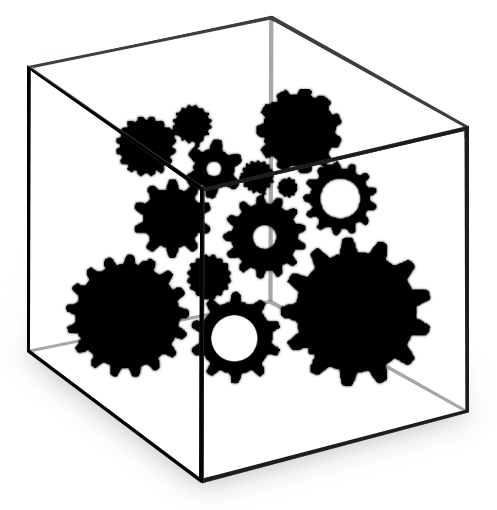

# La importancia del Software Libre

Cuando se habla del software libre, se viene a la cabeza el proyecto Linux, un sistema oprativo que puede ser instalado gratuitamente en su computadora. Pero el software libre es más que programas gratuitos. Software libre es un modo de producir software que puede generar o no herramientas gratuitas. Ser “gratis” no es su principal objetivo, pero sí garantizar cuatro otras libertades fundamentales:

- La libertad de ejecutar el programa, para cualquier propósito.
- La libertad de estudiar como el programa funciona y adaptarlo para sus necesidades.
- La libertad de redistribuir copias de para ayudar al prójimo.
- La libertad de perfeccionar el programa y liberar sus perfeccionamientos, de manera que toda la comunidad se beneficie de ellos.

Uno de los factores que contribuyeron para la difusión de movimiento de software libre fue la apertura del Internet más allá de las fronteras militares y universitarias. Los proyectos de software libre se apropiaron de la red para distribuir y convocar voluntarias a que contribuyan. En el caso de Linux, a partir de un código inicial elaborado por Linus Torvalds, millares de programadoras esparcidas por el mundo y conectadas por el internet desarrollaron un sistema operativo extremamente robusto, capaz de competir con los productos de grandes industrias de software.

Analizando el fenómeno, Eric Raymond sugiere la metáfora de la catedral y del bazar para diferenciar el modelo de desarrollo de la industria tradicional y de esas redes de colaboradores voluntarios.

- El modelo **catedral** consiste en subdividir las tareas de programación del sistema entre un número limitado de programadoras, reduciendo al máximo los cargos conocedores de la visión general del sistema para, entre otros motivos, asegurar la sigilosidad comercial del proyecto.
- El modelo **bazar** es exactamente lo opuesto: lanzar el concepto del producto lo más pronto posible, aunque se encuentre incompleto o con fallas y abrir su código fuente para que cualquier persona pueda contribuir directamente al proyecto usando las herramientas de comunicación por Internet.

El software libre inauguró una nueva forma de producción. No obstante, sus productos generalmente son elaborados con un mayor enfoque en conseguir desarrollar sus funciones para el uso real que será hecho de ellas. De cierta forma, lo ideal es que la usuaria de estos productos también sea una programadora, o que se transforme en una. Para quien no sea parte de esta comunidad, sólo es posible participar de ella sabiendo o aprendiendo a escribir código. Para quien ya toma parte de ella, esto implicaría crear una barrera que impediría que ciertos conocimientos sean aprovechados, resultando en la pérdida de contribuciones de personas que simplemente no consiguen acercarse.

## Participación de las usuarias

En el diseño, especialmente en dominios de la comunicación y de la interactividad, es de sentido común reconocer la importancia de las “no diseñadoras”, generalmente caracterizado en la figura de “usuaria”. Incluir a estas en el proceso de desarrollo es fundamental. Las diferentes metodologías de diseño actúan como grados de aproximaciones diferentes con la usuaria. Ella es considerada como una no-diseñadora; una no-desarrolladora es, a la larga, su modo de desarrollarse y de proyectarse. De esta forma, El diseño libre asume la importancia de incluir también en este proceso de participación del software a la usuaria que no programa, entendiendo que el software libre no se restringe al software.

En el software libre, la colaboración gira en torno del código fuente de programación, especificando en un lenguaje objetivo, compartido y aceptado por todas las colaboradoras. Cuando pasamos al diseño libre, la cuestión de la distribución es más difusa, pues no existe un lenguaje capaz de hacerse cargo de la multiplicidad de significados en un sistema limitado.

Las comunidades de software libre desarrollaron métodos y herramientas muy eficaces para compartir códigos de programación; no obstante, las interfaces de los softwares desarrollados de esta forma acostumbran a ser difíciles de usar para usuarias no envueltas en este proceso. No se sabe muy bien cómo trabajar el diseño en el software libre, pues la dinámica de desarrollo es diferente.

El diseño en el software propietario ocurre a través de investigaciones con usuarias presenciales y decisiones centralizadas. Eso no funciona en software libre, cuando el desarrollo es distribuido geográficamente y de forma asíncrona. Por esta y otras innumerables distinciones, estas comunidades se han mantenido distantes.

El diseño libre busca caminos para aproximar la comunidad de diseño con la comunidad de desarrolladores de Sofware Libre, entendiendo que los desafíos para que esto suceda no se resumen a cuestiones puramente “técnicas”. El acceso de diferentes comunidades al software libre es beneficioso en diversas formas. Un ejemplo fue la aproximación entre el Derecho y las tecnologías de información (TICs). El conocimiento profundo sobre códigos y programación de aquellos resultó en el encuentro de brechas legales que ayudaron a garantizar la libertad efectiva del Software Libre.

No es una cuestión de “meterle diseño” al software libre, pues existe diseño en todos los proyectos de software libre. Lo que no siempre hay es el ejercicio de pensamiento proyectual sistemático. Tampoco es una cuestión de que apenas existan diseñadoras en proyectos software libre y esperar que de ahí resulten software libres más fáciles de usar. Los softwares libres de fácil uso pueden simplemente desanimar a personas que quieran profundizar al software y mejorarlos, terminando en aceptarlos como están sin trabajar su capacidad de transformarlos. Es necesario diseminar una cultura de diseño consciente.

## Herramientas libres

El diseño libre, antes de ser diseño libre, era entendido como diseño con software libre. El término era utilizado para diseñar eventos, concursos y desafíos que incentivaban y diseminaban la práctica del diseño utilizando software libre.

Con el diseño libre buscamos mostrar cómo el diseño no se vuelve libre sólo por usar herramientas libres, sino que necesita de herramientas libres para garantizar su libertad. Si no es hecho así, ¿cómo se espera que las personas tengan acceso a las fuentes si ellas no poseen las licencias de los programas propietarios? Ese es el *software-centrismo*: la tendencia a menospreciar la diversidad de herramientas disponibles, creyendo que todas las otras personas poseen, usan (o deberían usar) el mismo software que ella.

La utilización de software libre aún causa polémica entre diseñadores. Algunos creen que es imposible, una utopía. Otros lo consideran antiprofesional, una pérdida de tiempo. Contrariando esta perspectiva, varios pioneros buscaron atraer el interés y diseminar conocimiento sobre la práctica de diseño con software libre, mostrando cómo una persona puede utilizarlos para hacer trabajos de calidad, superando incluso a aquellos que utilizan herramientas propietarias.

El diseño libre, por lo tanto, no es una mera utilización de herramientas de código abierto en la ejecución de proyectos. Aunque ellas sean, de hecho, utilizadas y preferidas cuando posible, la propuesta de diseño libre es la de abrir el proceso de desarrollo de software y hardware para todo tipo de usuario. Es tan importante abrir el proceso como el código fuente, que es el resultado de este proceso.

Abrir el proceso significa que existe la posibilidad de participación en varios niveles. Una persona puede colaborar con el código de programación; sin embargo, otra que no tiene conocimiento para tal podría participar de la elaboración de los flujos de interacción, de la diagramación de las interfaces y de la definición de nuevas funcionalidades. Usando aplicaciones web y archivos abiertos, es posible habilitar la colaboración en aspectos que van más allá del código de programación.

No hay software intuitivo. Tratándose especialmente de softwares propietarios, como los que son comúnmente utilizados por diseñadores, basta con ver el primer contacto de un principiante para ver que no son nada fáciles de aprender.

Las solicitudes de [“*métele más diseño*”](https://youtu.be/XbhW-FToKgk), que los diseñadores tanto odian, refleja esta problemática: dominar estas herramientas exige práctica y conocimiento. No es el software el que se adecúa a partir del conocimiento de su usuario, y en caso contrario, incita a que muchos desistan de la difícil tarea. Es necesario (re)construir sus propias herramientas para que, solo así, sean realmente suyas.

> NAHUI EJEKATMET 
> Ejekat pal yanhuit 
> Nialika palehuiat istak 
> Mishigan ihuan nusan 
> Tiaktamet ipal sihuatagat 
> Gajaguimatiket mijmintik 
> Guitaliat tajtaya uan ijtilia 
> Ipalli se yanhuit kinij. 
> % 
> CUATRO LIBERTADES 
> Vientos del cambio 
> Evoquen altruismo 
> Distribución con igualdad 
> Principios de equidad 
> Jerarquías lineales 
> Usando recursos con respeto 
> Para una nueva era. 
> [Walter Mauricio Garcia —Colectivo “Sennemit Shinakti”]
