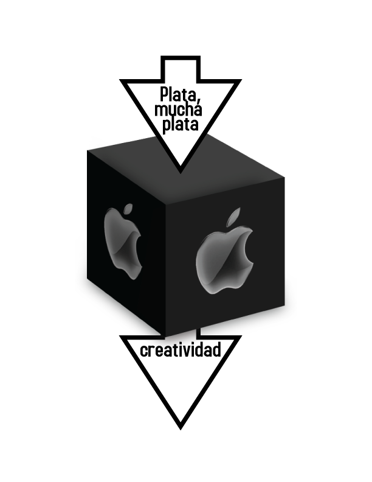
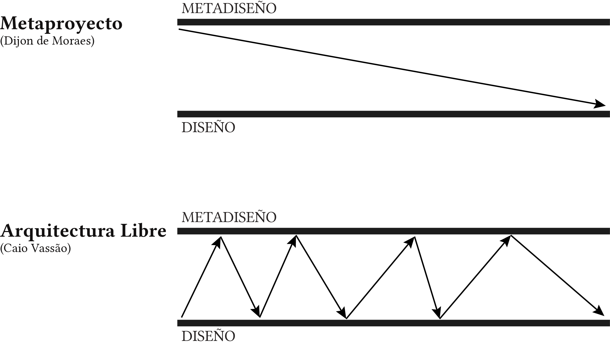

# El código de diseño
## El código
El código es un filtro por el cual las expresiones de los participantes del proceso adquieren existencia propia, tornándose fáciles de compartir. La expresión en el lenguaje natural es codificada en un lenguaje especifico que facilita su almacenamiento. Cuando alguien recibe una expresión realizada por otra persona, puede abrirla y continuar el trabajo, pero se necesita usar el mismo código para comprenderla.

En la práctica de diseño son usados diversos códigos: escritura técnica, cuadrículas visuales, escala cromática, plantillas y otros. El problema es que no siempre los códigos son capaces de expresar todo lo necesario para que haya una comunicación completa. Los códigos de diseño se encuentran todavía en fase embrionaria, careciendo de sistematización y herramientas apropiadas para trabajar con ellos.

Una de las propuestas del diseño libre consiste en desarrollar el código del diseño más allá del proceso tradicional, en el que los códigos sirven básicamente para generar la documentación y anotaciones de las decisiones finales del proyecto. Aquí el código se convierte en un punto clave, funcionando como una especie de rastro del proceso y permitiendo que este sea vuelto a hacer, rediseñado y reescrito. Esta es una necesidad de comunicación de un diseñador con otro: con quien desarrolla y produce, y con quien necesita del diseño. Los códigos deben posibilitar lo mínimo para habilitar la colaboración. No hay necesidad de hacer que una máquina comprenda el diseño. Mientras las personas se encuentren participando del proceso, estas cuentan con la capacidad de leer entre líneas.

Debemos desarrollar herramientas que permitan esa ambigüedad en la comunicación; sin embargo, no debemos descartar las ventajas productivas de la organización sistemática. Estructuras eficientes que sean utilizadas sin dificultades pero que puedan ser abiertas y modificadas en caso de que haya una falla en el flujo comunicativo. Lo importante es saber lidiar con esa falla, pues estas son inevitables.

## La caja negra

La fluidez en el proceso creativo depende de una serie de conceptos que dejan detalles del lado para permitir concentrarse en el todo. Mientras tanto, los detalles dejados a un lado tendrán que ser reconsiderados. Si la máquina se detuviera y no se supiera como arreglarla, esta se convierte en una caja negra.

La metáfora de la caja negra se utiliza para ejemplificar procesos donde se coloca algo de un lado (*input*) y se recibe lo que aparece en la salida (*output*). Vos no sabés o no podrías saber lo que sucede ahí dentro, pues solo tenés acceso a las entradas y salidas. Por ejemplo, cuando presionás un interruptor, y una luz se enciende: todo esta bien, a no ser que ocurra un problema y al presionar el interruptor la luz no encienda. Entonces se cae en la cuenta de que para que esa luz se encienda no basta con presionar el interruptor. Hay un problema físico del sistema, un servicio que no fue pagado, una empresa que quizá haya tenido un problema, o una compañía hidroeléctrica puede estar sin agua. Es ahí que surge la pregunta: ¿Cómo es que esto funciona realmente?

El software libre busca liberar a los usuarios de la caja negra. Mientras tanto, aunque se abran las cajas, tenemos otros códigos y cuestiones no modificables que están más allá de los códigos de programación del software, como la emoción, cultura, política, que también forman parte del proceso. Así, un código abierto puede ser también una caja negra, si el proceso de desarrollo de este fuera una caja negra en si mismo.

¿Por qué el proceso de diseño requiere suceder de forma oscura? ¿Existen asuntos que nadie debería conocer? El diseñolibre permite la apertura del proceso de creación en sus máxima transparencia, e incluso, que tal control sea realizado por todos. Él no es un proyecto estancado, sino que es un proyecto vivo, el cual puede ser alimentado para crecer y generar una prole basado en su información genética. El diseño libre es adaptable, basta con el esfuerzo de la comunidad interesada para que ocurra.

A diferencia del software libre, en el cual los *forks* o bifurcaciones de código son desvinculados del proyecto principal, en el diseño libre tales *forks* son el objetivo principal. Estos son el verdadero vínculo que existe entre el proyecto y la realidad, demostrando que alguien realizó un esfuerzo considerable para transformar el proyecto en otra cosa, cambiando incluso su ideología base.

## Metadiseño

A la larga, ¿qué tipos de conocimiento además de la experiencia propia previa, son necesarios para la efectiva participación de una persona en el proceso de diseño? Joan Ernst van Aken presenta tres categorías de conocimiento general de diseño:

- Conocimiento del objeto: representa los conocimientos respecto a las características y propiedades de los artefactos y sus materiales.
- Conocimiento sobre la fabricación: son los conocimientos sobre los diferentes procesos físicos que serán utilizados para fabricar o construir los artefactos proyectados.
- Conocimiento del proceso: consiste en los conocimientos sobre las características y propiedades de los procesos de diseño, que pueden ser utilizados para producir un nuevo proceso de diseño.

Los objetos, obviamente, únicamente ofrecen los conocimientos del objeto mismo. Son necesarios los metaobjetos, cosas que nos ayuden a entender tales objetos. Otra propuesta de diseño libre es abrir esos metaobjetos para el aprendizaje, adaptación, colaboración y subversión. Crear sus propias herramientas de trabajo a partir del trabajo propio. Dos ejemplos para contrastar: el calzado de caucho creado por los caucheros de Acre y las sandalias *Crocs* fabricadas en los Estados Unidos. El calzado brasileño fue una innovación de al menos cien años previo a los *Crocs*, mas no tiene ningún impacto en este último, y acabó convirtiéndose en un calzado barato para quien no puede comprar zapatos de cuero.

No se espera que quien realiza el trabajo manual, que el usuario, piense fuera de la caja mientras que los diseñadores difícilmente consiguen hacerlo también. Existe una serie de cajas que restringen el diseño: metodologías, herramientas, principios, tendencias, estilos. El diseñador trabaja dentro de las cajas la mayor parte del tiempo, escogiendo entre opciones de colores y tamaños.

Una frase de David Freeman, escritor de guiones para juegos, ilustra muy bien esa posibilidad: “Encuentre el cliché y sáquelo”. Es preciso saber lo que se considera normal para poder ser innovador. No es una cuestión de pensar fuera de la caja; innovación consiste en repensar la caja. Pensar en la caja es repensar el diseño. Es ir del diseño al metadiseño, tal como ir del lenguaje al metalenguaje: el lenguaje usado para hablar de lenguajes. El diseño del diseño. Existen dos grandes teorías en Brasil sobre metadiseño.

La primera es representada en el libro *Metaprojeto* (Metaproyecto) de Dijon de Moraes. Basándose en la tradición del metaproyecto italiano, Moraes propone que el estudiante de diseño realice un estudio exploratorio antes de realizar el proyecto, levantando toda la información necesaria para un proyecto consciente de las posibilidades. El libro presenta de forma inequívoca al metaproyecto como una fase anterior y separada del proyecto. El segundo abordaje fue desarrollado por Caio Vassão en el libro Metadiseño. Vassão coloca la cuestión del metadiseño en una perspectiva integral, como la tendencia general de formalización de la sociedad. Preocupado con el empobrecimiento de la experiencia de vida de una sociedad totalmente proyectada, Caio propone la Arquitectura Libre. La Arquitectura Libre no rechaza al Metadiseño, sino que recomienda que el Metadiseño sea actualizado de forma constante.

Su tesis sobre Arquitectura Libre es una de las principales referencias para el diseño libre. En lugar de abordar el diseño como un proceso abstracto o una habilidad del individuo, Caio desarrolla la noción del proyecto colectivo. Eso vuelve a sus ideas mucho más interesantes para fundamentar proyectos en grupo como actividad pedagógica. Cuando el diseñador trabaja solo, su reflexión sobre el metadiseño ocurre solo en sus pensamientos. Sin embargo, cuando el proyecto se realiza en grupo, el metadiseño se vuelve más visible: es obligado a verbalizar, escribir o expresar de alguna forma su reflexión para participar del proceso.

> Estoy a tu lado 
> y te das cuenta, 
> que he muerto 
> por una causa mayor. 
> [Polly Class - Sofia]
