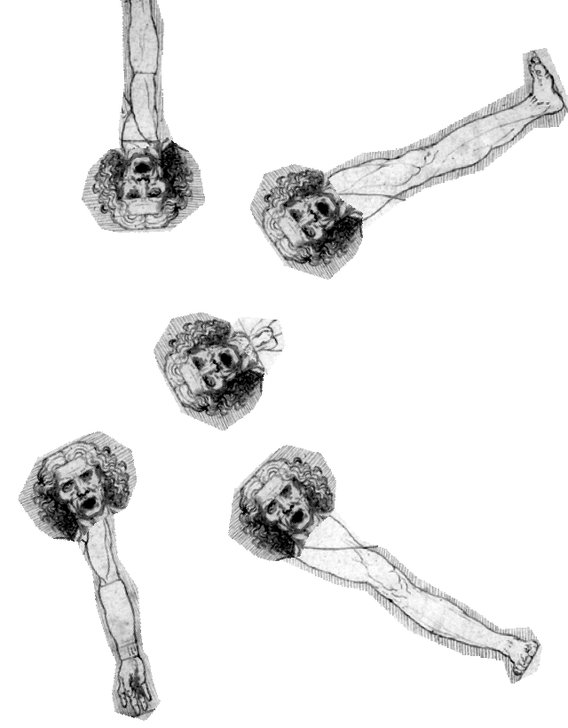

# Pupusa loca D'Libre Desain
Resumiendo, el Diseño Libre es una pupusa loca salvadoreña o un gaspacho español. Una morcilla de ideología. Una paella valenciana con valor agregado. Es un chorizo apetitoso, de aquellos llenos de cosas que vos ni querés saber de dónde vinieron. Diseño, libre, es hacer diseño con tortilla. Omelette con rizoma. Tomá todo lo que tenés en la refrigeradora y ponelo en una sartén.
El material del Diseño Libre no es la interacción, ni lo digital, o la colaboración; nada de eso. Nuestro material de trabajo está en depósitos tupperware que estaban guardados allá en el fondo, junto a aquel frijol en un depósito de sorbete.
Quiere decir, entonces, que ustedes en lugar de dar el pescado, ¿ustedes enseñan a pescar? No, nosotros no enseñamos a pescar, mostramos lo que se necesita para ser vegetariano. Tener la opción de acción, estar consciente de lo que se está comiendo, el origen de la comida.
El diseño libre no es una pupusa loca, sino el hecho de hacer una. Entonces no se exagera en la cantidad de queso.

> O seu amor é canibal Comeu meu coração Mas agora eu sou feliz O seu amor é canibal Meu coração Agora é todo carnaval.
> %
> Su amor es caníbal. Comió mi corazón. Pero ahora soy feliz. Su amor es caníbal. Mi corazón ahora es todo carnaval. [Ivete Sangalo - Canibal]
