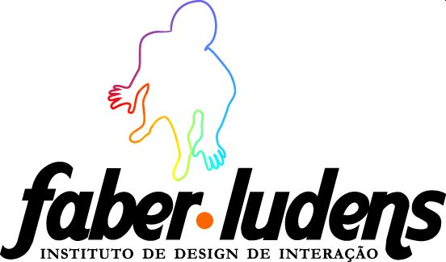

# Sobre el Instituto Faber-Ludens

El Instituto Faber-Ludens de Diseño de Interacción es una nueva entidad sin fines lucrativos que promueve el desarrollo del Diseño y de la Tecnología en Brasil a través de la integración entre mercado y academia desde 2007.

El Instituto está compuesto por un equipo multidiciplinar comprometido con la transformación de la sociedad en nível nacional y global. Por tratarse de un área carente en investigación y graduación, y de alta demanda por la populación brasileira, el Instituto tiene como enfoque las tecnologías de comunicación. Entendemos como tecnologías de comunicación todo artefacto utilizado para dar soporte a la interacción entre personas como teléfonos celulaes, juegos, websites, software sociales, instalaciones artísticas, etc.

Preocupados en desarrollar metodologías de diseño adecuadas para la realidad brasileña, buscamos en nuestra cultura características que podrían generar innovación. Tres conceptos clave para nuestro modo de trabajo: jeitinho brasileiro (la forma de ser del brasileño), gambiarra (adaptación) y humor. Creemos que la capacidad del brasileño para adaptarse a situaciones adversas, de conseguir reír de la desgracia y formular soluciones improvisadas podrían ser, en lugar del estigma, innovación.

Para nosotros, la tecnología es un medio, no un fin. Queremos, con esta, imaginar una sociedad más justa y divertida, que ofrezca oportunidades para el desarrollo de los individuos y de los colectivos, sin discriminación.

Hacemos esto a través de cuatro procesos: a) observación de las relaciones sociales en una determinada situación; b) interpretación cultural; c) prototipos low-tech de nuevas tecnologías y d) publicación de todo conocimiento generado en los procesos anteriores. Este último tiene especial importancia, pues garantiza que tenga impacto social aunque no sea implementado. A través de nuestro sitio web, miles de personas están aprendiendo sobre Diseño de Interacción con las descripciones de nuestros proyectos y la base de conocimiento que se forma a partir de ellos.

Los proyectos de investigación desarrollados Instituto Faber-Ludens utilizan la plataforma libre Drupal para su organización interna. La colaboración está abierta para cualquier interesado a través del website faberludens.com.br. Durante y después del proyecto, las discusiones quedan todas disponibles para consulta y licenciadas por Creative Commons. Eso significa que un visitante del website puede continuar el proyecto en otro contexto, copiando elementos o reproduciendo el propio proceso de desarrollo. Nominamos nuestro abordaje de Diseño Libre: un diseño que es libre para aprender, usar, copiar, transformar y subvertir. Creemos que diseño es el conocimiento clave para el desarrollo social para el siglo XXI y este conocimiento no puede ser restringiendo a académicos y profesionales especializados. El diseño debe ser libre para todo y todos.
