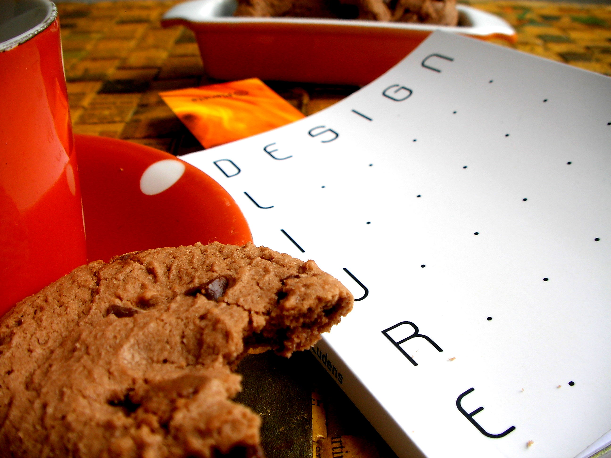

# Acerca del libro

Diseño libre (título original *Design Livre*) es un libro colaborativo escrito en una semana por la comunidad Faber-Ludens, publicado en PDF como proyecto gráfico abierto e impreso bajo demanda por el Clube dos Autores. Fue traducido al español en San Salvador en 2013.
## Version
1.1.0. Esta es la primera actualización al libro en siete años, para publicarse en markdown utilizando el paquete [bookdown](https://www.bookdown.org/) para R.
## Licencia
Este documento está protegido bajo una licencia CC-BY-SA 4.0.

